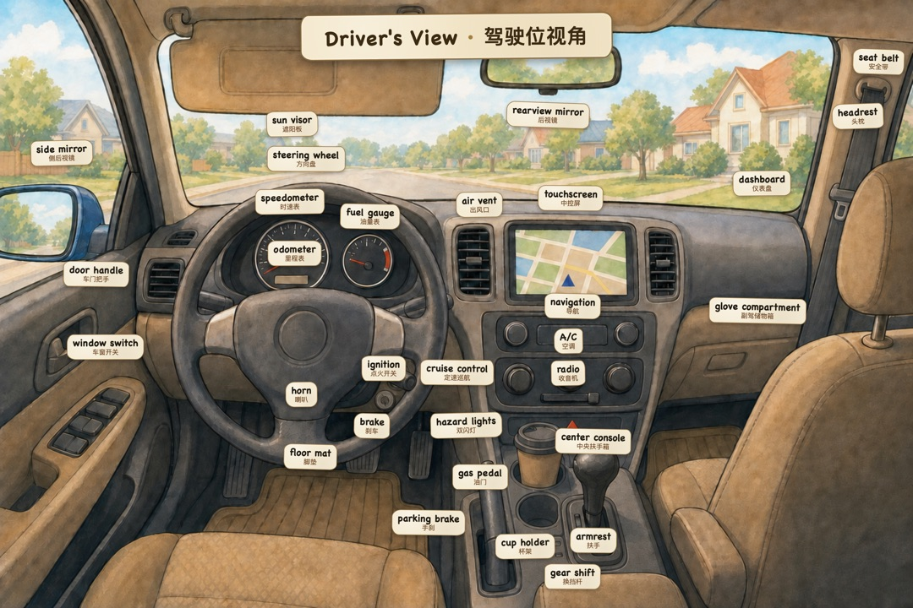

<div align="center">

[简体中文](README.md) · **English**

# 词境 · Cíjìng

**An open, reproducible pipeline for building point-and-read language worlds — plus a playable demo it produced.**

### ▶️ [**Play the demo — no download, just click**](https://mrsenter.github.io/cijing/)



<sub>Tap any object → English + phonetics + Chinese + example sentence + audio. Switch label modes, or hide them all to quiz yourself.</sub>

</div>

---

## The one idea that makes it work

> **The scene images contain zero text. Every word, phonetic, and translation is overlaid by the code layer at runtime.**

The AI only ever draws a *clean, wordless stage*. Nothing is baked into the pixels. That single constraint is what turns a picture into a language tool:

- **One image, many languages** — the artwork is generated once; swapping languages only swaps the word layer.
- **Hotspots, not hand-labels** — a vision model reads the image and emits percentage-coordinate boxes; the runtime draws the labels.
- **One hotspot set, four modes** — show both languages / English only / Chinese only / hide-all (which becomes a find-the-word quiz).

Bake text into the image and you get a poster: it can't be tapped, hidden, quizzed, or re-translated. Keep the image wordless and the code owns everything interactive.

## The factory (this is the actual project)

词境 is less "a vocabulary game" and more **a workflow for mass-producing them**. The game is the proof it works. The whole pipeline and its specs live in [**`factory/`**](factory/):

```
① Word list     decide the tappable objects in a scene (new words, no dupes)
     ↓
② Image task    → a wordless stage image        factory/templates/生图任务书模板.md
     ↓            (unified art spec + "no text" rule + physical-plausibility rule)
③ Visual audit   check every word is present, zero text, plausible   factory/pipeline/审计员岗位.md
     ↓            (missing object → local inpaint fix, not a full redraw)
④ Hotspots       read the image, box each word in % coords   factory/docs/场景数据格式.md
     ↓
⑤ Assemble       word list + hotspots + image → one slide object
     ↓
⑥ Audio          English via Kokoro / Chinese via edge-tts   factory/pipeline/发音管线/
     ↓            (+ whisper machine-ear QA to catch TTS failures)
⑦ Ship           browser smoke-test → single-file build      factory/pipeline/发音管线/打包便携版.py
```

Two "libraries" hold a whole town together:
- **Character library** — a fixed cast with written appearance anchors + a reference sheet, fed to the image gen so the same people stay consistent across every scene. (So *you* can be the protagonist.)
- **Scene library** — each scene is a slide; their order encodes a spatial route through the town (↑↓ = change scene, ←→ = pan views within a scene). So it's a *city*, not a pile of loose pictures.

## Build your own — honestly

This is a **human-in-the-loop, multi-step workflow, not a one-click generator.** You direct each stage; the tools do the heavy lifting. Bring your own:

- **Image generation** — any `image_gen` agent (the author uses Codex CLI). You supply the API/model.
- **English TTS** — [Kokoro-82M](https://huggingface.co/hexgrad/Kokoro-82M) + [mlx-audio](https://github.com/Blaizzy/mlx-audio) (Apache-2.0, redistributable).
- **Chinese TTS** — [edge-tts](https://github.com/rany2/edge-tts) (Microsoft online voices).
- **QA** — [whisper.cpp](https://github.com/ggerganov/whisper.cpp) to grade the generated audio.
- **Posters** — Node + Playwright.

A minimal one-command example (one scene image + a tiny word list → one playable HTML) is in [`factory/quickstart/`](factory/quickstart/).

## Limitations (read before you get excited)

- **No one-click.** Generating a scene is human-directed: write the task-book, generate, audit, fix missing objects by local inpainting, hand-place hotspots. The auditing and hotspotting still need a human in the loop.
- **Bring your own image model.** No image weights are shipped; you wire in your own `image_gen`.
- **Chinese audio isn't bundled.** edge-tts uses Microsoft's online voices — redistributing the generated mp3s is a legal gray area, so the shipped build has no Chinese audio (it falls back to the browser's Web Speech voice). English audio (Kokoro, Apache-2.0) *is* bundled.
- **Coverage is partial.** ~27 everyday scenes so far — nowhere near exhaustive. It's meant to grow, or to be rebuilt as your own town.
- **The art is AI-generated.** Occasional synthesis glitches; a whisper QA pass has been run, but trust your ears/eyes.

## The demo, briefly

- **27 scenes · ~800 words** — home (bedroom / kitchen / bathroom) → out (supermarket / café / clinic / barbershop) → travel (airport / hotel), plus a town map you tap to enter scenes.
- **Fully local** — open and play; no login, no network, no ads, no tracking.
- Play online above, or [download a single self-contained html](https://github.com/MrSenter/cijing/releases/latest) to run offline. (iPad/iPhone: the Files app only previews it — open with Edge, or serve it over your LAN. Details in [简体中文 README](README.md).)

## License

| Part | License |
|------|---------|
| Code (`index.html`, the `factory/` scripts) | **MIT** |
| Assets (illustrations, audio, vocabulary) | **CC BY-NC 4.0** — credit "词境 / Cíjìng", non-commercial |

See [`LICENSE`](LICENSE) and [`LICENSE-assets.md`](LICENSE-assets.md). The cartoon characters are residents of the town — please don't use them commercially.

## Credits

Built on [Kokoro-82M](https://huggingface.co/hexgrad/Kokoro-82M), [mlx-audio](https://github.com/Blaizzy/mlx-audio), [edge-tts](https://github.com/rany2/edge-tts), [whisper.cpp](https://github.com/ggerganov/whisper.cpp), and Playwright.
