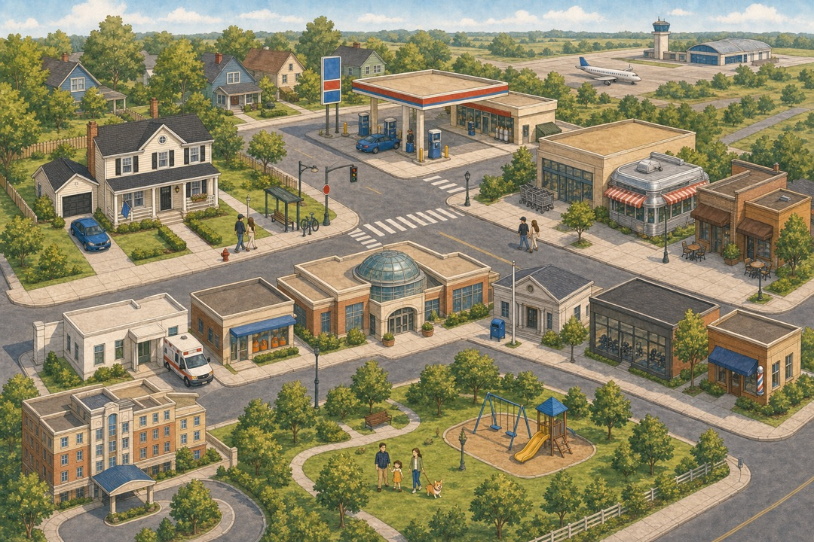
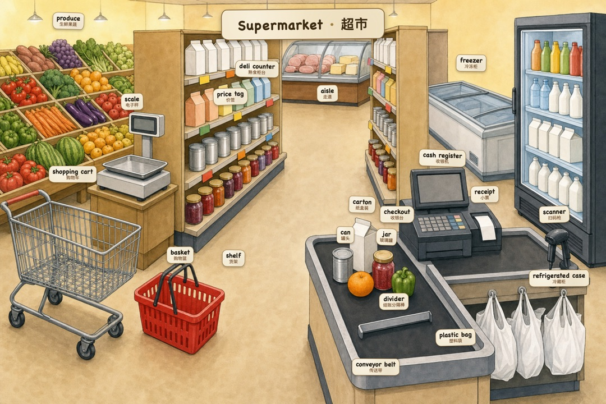
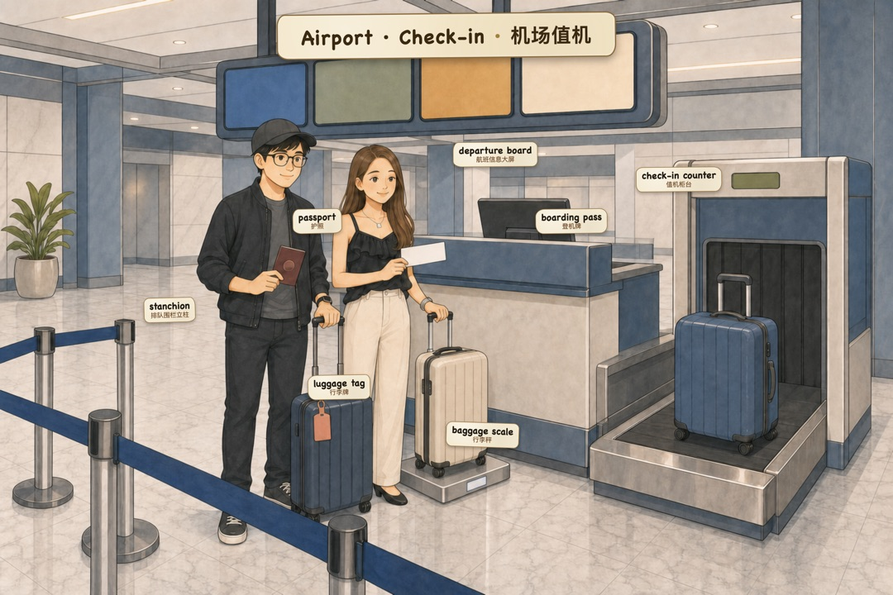
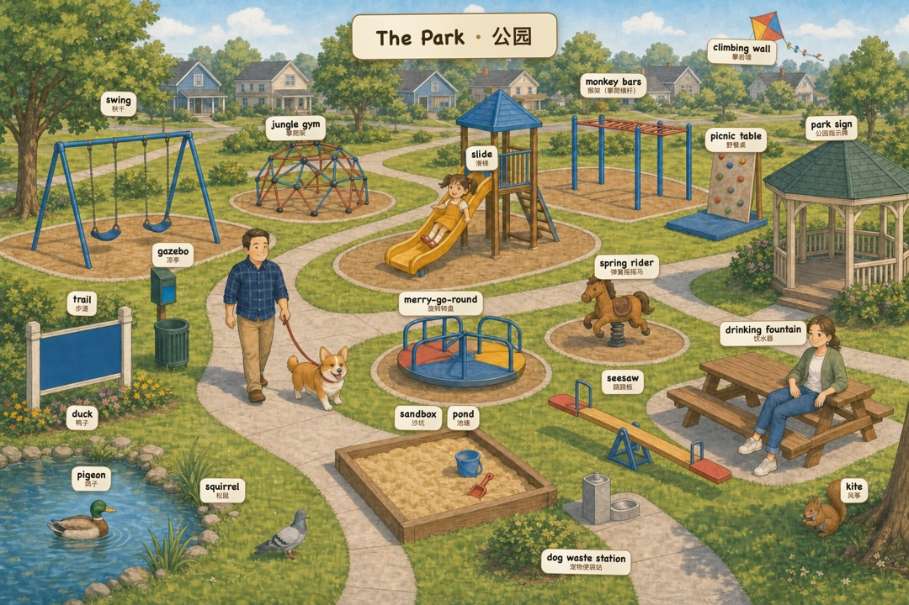

<div align="center">

**简体中文** · [English](README.en.md)

# 词境 · Cíjìng

**把生活场景变成可点读的英语学习游戏**

一图一境，点物体 → 单词 + 发音 + 中文。像大人的点读笔。

*"你身边那些叫不出名字的东西。"*

<br>



<sub>一座完整的小城市 · 点任意建筑直达场景</sub>

<br><br>

### ▶️ [**在线试玩 —— 点开就玩，不用下载**](https://mrsenter.github.io/cijing/)

<sub>或 [下载单文件版](https://github.com/MrSenter/cijing/releases/latest) 双击离线玩（一个 html，图和发音全打包）· 手机/平板见下方</sub>

</div>

---

> **这个仓库两种用法** 👇
> - 🎮 **想玩** → [**在线试玩**](https://mrsenter.github.io/cijing/)（点开即玩）或 [下载单文件](https://github.com/MrSenter/cijing/releases/latest) 离线玩
> - 🛠️ **想复刻 / 加场景 / 换语言** → 看 [**`factory/` 目录**](factory/)，那里是**完整生产工作流**（角色库/场景库、生图任务书、视觉审计、发音管线、海报管线 + 全套规范）

## 这是什么

词境是一套**场景点读英语学习游戏**。每一张图是一个生活场景（厨房、汽车、超市、机场……），画面里的每个物体都能点——点一下，弹出它的英文名、音标、中文和例句，还会读给你听。

- **27 个场景 · ~800 个单词**：从家里（卧室/厨房/浴室）到出门（超市/咖啡店/诊所/机场/酒店），一座完整的小城市
- **四种玩法**：中英双显 / 只看英文 / 只看中文 / 全部隐藏（变成"找词"测验）
- **一张全镇地图**：点建筑直达对应场景
- **纯本地运行**：打开即用，不联网、不上传、无广告、无追踪

<p align="center">
  
  
  
  
</p>

<sub>点物体 → 英文 + 音标 + 中文 + 例句 + 发音。上图是「中英双显」模式，还可切成只看英文/只看中文/全隐藏考自己。</sub>

## 给谁玩

- **想学地道生活词的人**（在国外生活的留学生 / 新移民 / 海外华人，或国内想补"课本不教的生活词"的人）——这是词境的主场。你能聊 economy、politics，却不一定知道家里那根"落水管 downspout"、洗漱台"vanity"、汽车"挡泥板 mud flap"叫什么。词境跟着真实生活动线走，学的都是**下次真会用到**的词；看病、租房水电、修车这些"关键时刻卡壳"的场景也专门做了。
- **小朋友的英语启蒙 / 亲子共学**——绘本画风 + 点读 + 发音，适合陪孩子边看边认物、学英文。内容整体偏**日常生活**，孩子最容易上手的是厨房、卧室、公园、超市这些贴近他们的场景（汽车维修、水电系统这类偏专业，大点或跟着大人玩更合适）。

## 怎么玩

**电脑（Mac / Windows）**：下载后双击 `index.html`，用浏览器打开即可。

**iPad / iPhone**（两条路，任选）：

> ⚠️ iOS 有个坑：把 html 传到「文件」App 后，**直接点开只是预览、进不去游戏**（Safari/Chrome 甚至不出现在"打开方式"里，这是 iOS 系统限制）。用下面任一方法：

- **方法 A · 装 Edge 浏览器**：把文件夹传到设备 → 「文件」App 里分享 → 用 **Edge** 打开 `index.html`（Edge 注册了本地 html 处理器，能正常进入，体验完整）
- **方法 B · 局域网直连（不用传文件）**：电脑上把这个文件夹起个本地服务，手机/平板连同一 Wi-Fi（或直接连电脑开的热点），浏览器输入链接就能玩：
  ```bash
  # 电脑上（在 cijing 文件夹里）跑：
  python3 -m http.server 8000
  # 然后手机/平板浏览器打开： http://<电脑局域网IP>:8000
  #（电脑IP：Mac 看「系统设置→网络」，或终端 ipconfig getifaddr en0）
  ```
  电脑开个人热点、手机连上，同样输 `http://<电脑IP>:8000` 即可——出门没 Wi-Fi 也能玩。

**操作**：
- **点画面里的物体** → 听发音、看单词卡
- **↑ ↓** 换场景　**← →** 场景内切换视角（如汽车的四个视角、机场的值机→安检→登机口→取行李）
- 顶部 **中英双显 / 仅英文 / 仅中文 / 全部隐藏** 切换标签；切到「全部隐藏」可开始**找词测验**
- 左边 **📖 目录** 按 🏠房子 / 🚗交通 / 🛒外出 分层；右边 **🗺 地图** 点建筑跳场景
- 单词标签**默认半透明、点一下浮到最上层**，密集场景也点得到

## 发音说明

- **英文发音**已内置（本地音频，[Kokoro-82M](https://huggingface.co/hexgrad/Kokoro-82M) 神经语音，Apache-2.0）
- **中文发音**未内置（见下方许可证说明），点中文时会调用浏览器自带的中文语音朗读。想要离线中文发音，可自行生成 —— 方法见[`factory/pipeline/发音管线`](factory/pipeline/发音管线) 

> **发音是 AI 生成的**，绝大多数准确，但个别单词可能有合成瑕疵（发音略糊/吞音）。词境已经用机器验耳（whisper 对账）跑过一轮质检修复，但仍以人耳为准。想自己复查/重修发音，工作流仓库有整套**质检模式**（`发音质检.py`）——它需要额外下载一个开源语音识别模型（[whisper.cpp](https://github.com/ggerganov/whisper.cpp)）来给发音"判卷"。

## 许可证

词境把**代码**和**素材**分开授权：

| 部分 | 许可证 | 你能做什么 |
|------|--------|-----------|
| 代码（`index.html` 及脚本逻辑） | **MIT** | 随便用、改、商用，保留版权声明即可 |
| 素材（插画 / 音频 / 词库） | **CC BY-NC 4.0** | 可自由学习、传播、二次创作，**须署名「词境」、不得商用** |

完整条款见 [`LICENSE`](LICENSE)（代码）与 [`LICENSE-assets.md`](LICENSE-assets.md)（素材）。

> 插画里的卡通角色是词境这座城市的居民。素材禁止商用，请勿将角色形象或场景用于盈利用途。

## 场景还在长大 · 做一座你自己的城

> **说明**：这个项目**重点是打造背后那套工作流（`factory/`）**，游戏本身只是"证明工厂能出活"的样品。所以游戏里难免有些细节没打磨到位——精力主要花在流水线上，不在把 app 做完美。见谅，也欢迎提问题。

词境的生活场景**还没铺满**——邮局、学校、医院病房、菜市场、五金店……想加的还有很多。这是一座持续生长的城，也欢迎你一起添砖。

整套生产流水线就在本仓库的 [`factory/`](factory/) 目录，但它能做的不只是"加个场景"：

> **你可以把地图换成你自己的城镇，把你（和你在意的人）当作主角**，做一座只属于你的点读城。

这正是词境两个"库"的用处——**角色库**让固定角色跨场景长成同一个人（所以主角可以是你），**场景库**让一座城长出连贯的空间动线（所以那是"你的城"而不是散图）。换一门语言、加一个场景、造一整座新城，都从 `factory/` 开始。

---

<div align="center">
用 ❤️ 做给想边玩边学的人
</div>
